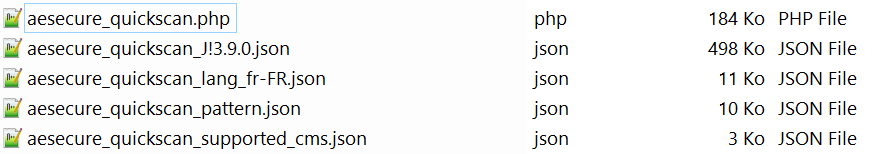
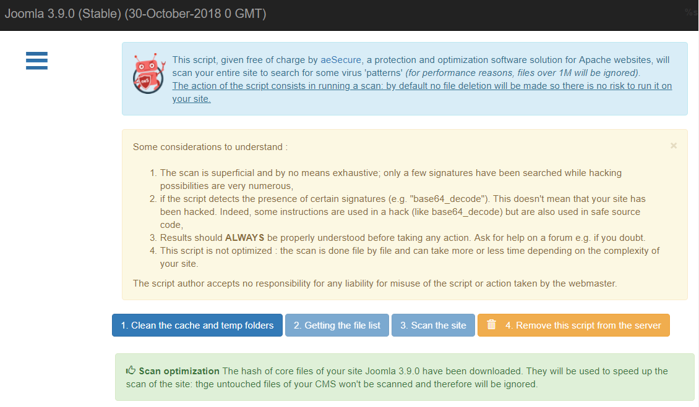
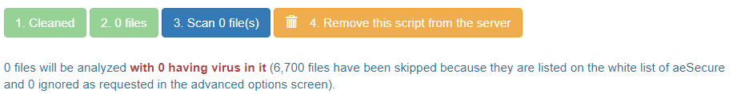
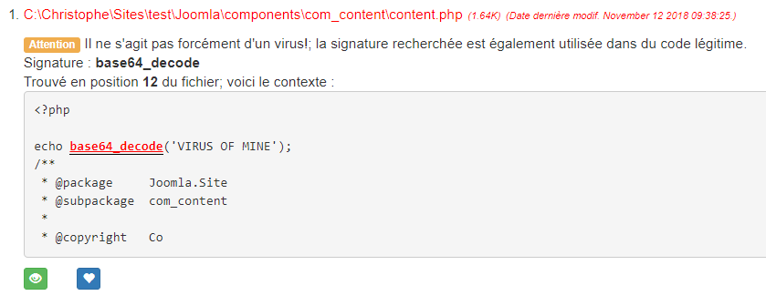
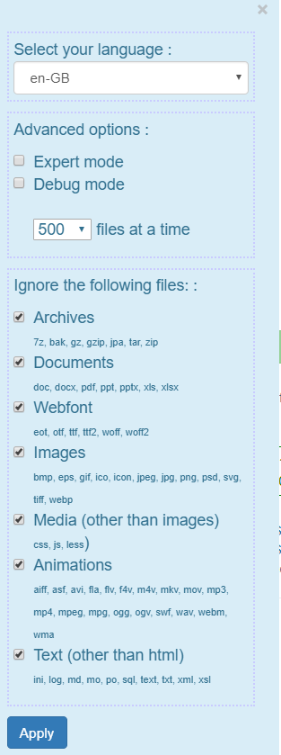

# aeSecure - QuickScan

<!-- cspell:ignore aesecure,quickscan,joomla,uncompress -->


> PHP script to install on your site (preferably in localhost for better performance) to scan files for viruses.

**aeSecure QuickScan already RECOGNISE MORE THAN 47.750 VIRUSES (September 2023) and use whitelist hashes to avoid to scan [WordPress](https://github.com/cavo789/aesecure_quickscan/tree/master/hashes/wordpress) and [Joomla](https://github.com/cavo789/aesecure_quickscan/tree/master/hashes/joomla) native files.**

> ℹ️ **INSTALLATION**
> You just need to get a copy of `aesecure_quickscan.php` and nothing else; please read [installation guide](#install).

## Table of Contents

- [Demo](#demo)
- [Install](#install)
- [Usage](#usage)
- [License](#license)

## Demo

You can play online with a demo here : [https://quickscan.avonture.be/](https://quickscan.avonture.be/)

## Install

aeSecure QuickScan will automatically download the files he needs, so the only thing you need to do is get a copy of the file `aesecure_quickscan.php` and nothing else.

1. Click on the following link to open the file in a new window: [get a copy of the script](https://raw.githubusercontent.com/cavo789/aesecure_quickscan/master/aesecure_quickscan.php)
2. Save the file at the root of your website *(preferably a local website for performance reasons)*

Note: you're not obliged to name the file aesecure_quickscan, you can f.i. name it `scan.php`.

In principle, you do not need to recover any other files, only the script `aesecure_quickscan.php` is sufficient.

### Old version

If you need a version for PHP 7.x, please download that one: [https://raw.githubusercontent.com/cavo789/aesecure_quickscan/fa76e4c01fc8819c32953ad747e5e81aec228df0/aesecure_quickscan.php](https://raw.githubusercontent.com/cavo789/aesecure_quickscan/fa76e4c01fc8819c32953ad747e5e81aec228df0/aesecure_quickscan.php)

## Usage

### Start QuickScan

So, in the root folder of your website, you've the `aesecure_quickscan.php` file (or `scan.php`). To run it, just start a browser and access the file by URL f.i. `http://localhost/my_site/aesecure_quickscan.php`.

### Automatic downloads

#### When the interface is displayed

aeSecure QuickScan will automatically download three or four files:

- `aesecure_quickscan_lang_en-GB.json` (can also be fr-FR or nl-BE) which is the file for your language. The preferred language will be detected from your browser's configuration;
- `aesecure_quickscan_pattern.json` contains configuration's items for the scanner;
- `aesecure_quickscan_supported_cms.json` contains a list of CMS software recognised by the scanner.

If your website is running a supported CMS like f.i. `Joomla` and a supported version, a file called `aesecure_quickscan_XXXXXX.json` will be downloaded (where `XXXXXX` is f.i. `J!3.9.0`).

If something goes wrong with the automatic download (no `CURL` support f.i.), you'll be prompted to download these files manually.



#### When 'Getting the file list' is fired

aeSecure QuickScan will automatically three or four more files:

- `aesecure_quickscan_blacklist.json` contains md5 hash of viruses;
- `aesecure_quickscan_edited.json` contains md5 hash of files where viruses have been added;
- `aesecure_quickscan_other.json` contains md5 hash of files that are considered as cleaned (like well-known Joomla's components);
- `aesecure_quickscan_whitelist.json` contains md5 hash of files that are considered as cleaned (manually processed file by file by Christophe, author of QuickScan);


### Discover the interface



A few things:

- If the website is running a supported CMS, his name and version number will be displayed at the top the interface _(this also means that a .JSON file has been downloaded for that CMS and that version)_,
- You have an extended menu at the left side of the interface. Click on the hamburger icon to show it,
- A few texts statements are displayed (click on the `x` icon to close them) and,
- The interface has mainly four action buttons:

1. Clean the cache and temp folders

To improve speed of the scan, `/cache` and `/temp` folders will be first emptied.
You need to click on this button first.

2. Getting the file list

Before starting the scan, QuickScan needs to know how many files he needs to scan. The `Getting the file list` action will get the list of all files of your site and all whitelisted files will be ignored. A whitelisted file is a file that QuickScan knows he's clean. How? Because the md5 hash of the file is mentioned in a whitelist file like the `aesecure_quickscan_J!3.9.0.json` (or any other whitelist files).

In other words: `Getting the file list` will only retrieve files that need to be scanned. In a fresh Joomla or WordPress installation, you'll have a very few files to scan since the native, core files are whitelisted. Explanation: I've generated hashes for a lot of versions (see https://github.com/cavo789/aesecure_quickscan/tree/master/hashes/joomla and https://github.com/cavo789/aesecure_quickscan/tree/master/hashes/wordpress). As soon as QuickScan can retrieve a hash file for the version of Joomla/Wordpress you're using, a hash will be computed for every single file of your site and if that hash is recognised, it means your file is healthy meaning his content is exactly the one present in a fresh installation of Joomla/Wordpress and thus didn't contain any viruses.  As soon as a core file has been altered, even with just a space character, the hash will be different thus not retrieved in the list. As a consequence, the file will be scanned even if part of the "core" files of the CMS. Only unmodified files will be considered as healthy and not scanned.

**Unmodified** files are whitelisted (if unchanged of course).

As you can see here below, on a fresh installation of Joomla 3.9.0, the number of files to scan is: zero. This because nothing was added to the site and thus 100% of files are in our whitelist.



3. Scan the site

Remaining files will be scanned and if something is found based on

- our patterns (stored in `aesecure_quickscan_pattern.json`),
- our blacklist hash (`aesecure_quickscan_blacklist.json`) or
- our edited hash (`aesecure_quickscan_edited.json`)



Then the file will be displayed, and you'll be able to whitelist him (if the file is clean (i.e. false positive)), ignore the file (just close the item) or kill the file.

Note: you can kill the file only when you're running in the expert mode of QuickScan.

4. Remove this script from the server

Once you've scanned your site; don't forget the kill the `aesecure_quickscan.php` script and all related JSON files. The `Remove this script` button will do this for you.

### Expert mode

By clicking on the hamburger icon at the top left of the interface, you'll show a menu where, f.i., you can enable the expert mode.

In that mode, you'll be able to specify a path (like making a scan of a subfolder) and you'll be able to kill a detected file. A `Delete this file` button will be displayed in the scan results.

You'll have another option:



## Creating hashes

You can create hashes by getting a copy of the `make_hashes.php` file from this repository.

For Joomla!, simply download the desired version by surfing on [https://downloads.joomla.org/cms](https://downloads.joomla.org/cms) and get the desired archive. Proceed exactly the same for WordPress.

If you need more than one version, just download all the required versions and save each archive in the `./hashes/joomla` folder.

It's important that the archive filename is updated and be, just, the version. For instance, rename `Joomla_5.0.0-Stable-Full_Package.zip` to `5.0.0.zip`.

In the example below, I've downloaded Joomla 4.4.0 till 5.1.0. Zip files are in my `./hashes/joomla` folder and I uncompress them by running the command below in my Linux console:

```bash
unzip 4.4.0.zip -d ./4.4.0 && rm -f 4.4.0.zip
unzip 4.4.1.zip -d ./4.4.1 && rm -f 4.4.1.zip
unzip 4.4.2.zip -d ./4.4.2 && rm -f 4.4.2.zip
unzip 4.4.3.zip -d ./4.4.3 && rm -f 4.4.3.zip
unzip 5.0.0.zip -d ./5.0.0 && rm -f 5.0.0.zip
unzip 5.0.1.zip -d ./5.0.1 && rm -f 5.0.1.zip
unzip 5.0.2.zip -d ./5.0.2 && rm -f 5.0.2.zip
unzip 5.0.3.zip -d ./5.0.3 && rm -f 5.0.3.zip
unzip 5.1.0.zip -d ./5.1.0 && rm -f 5.1.0.zip
```

Since I'm lazy, here is the Linux command to start for getting the list here above: 

```bash
for f in *.zip ; do var=`find "$f"`; echo "unzip $f -d ${f%.*} && rm -f $f"; done
```

This done, now I can start my browser and the `make_hashes.php` script.

If you're a Docker user, just run `docker run -d -p 8080:80 -u $(id -u):$(id -g) -v "$PWD":/var/www/html php:8.2-apache` in the folder where you've cloned this repository then start your browser and open `http://localhost:8080/make_hash.php`, wait a few seconds and you're done.

The script will immediately start the creation of the hashes; there is nothing to do; just wait.

After a few seconds, you'll get new JSON files (one by version) in `./hashes/joomla`. You can now, optionally, remove the subfolders; no more needed.

If you've written permissions to the [https://github.com/cavo789/aesecure_quickscan](https://github.com/cavo789/aesecure_quickscan) repository, just push new signatures to make them publicly available.

## License

[MIT](LICENSE)
